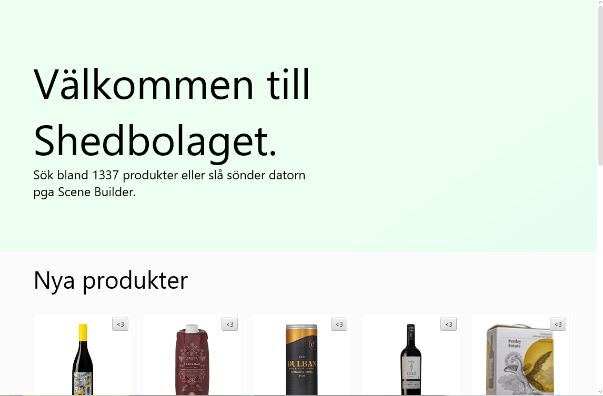
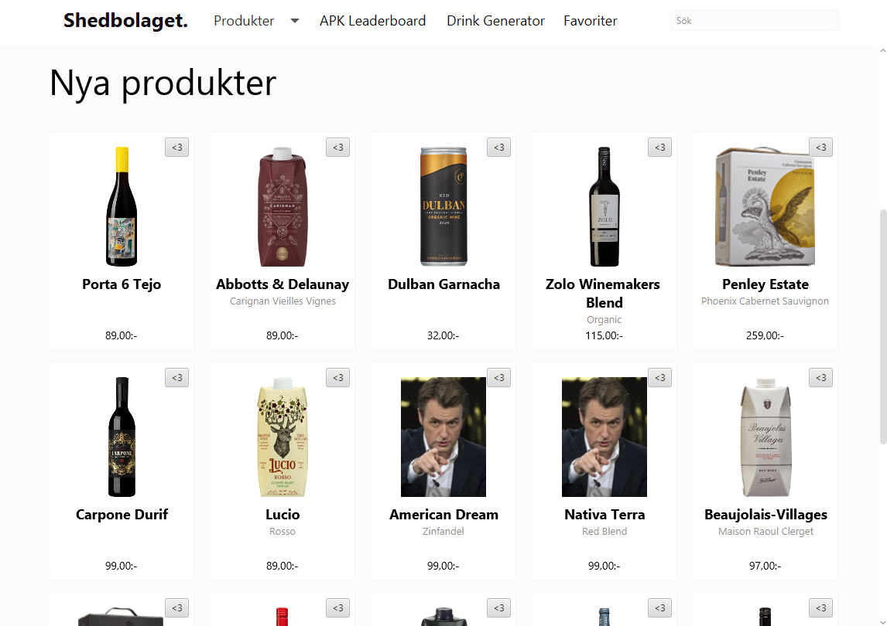
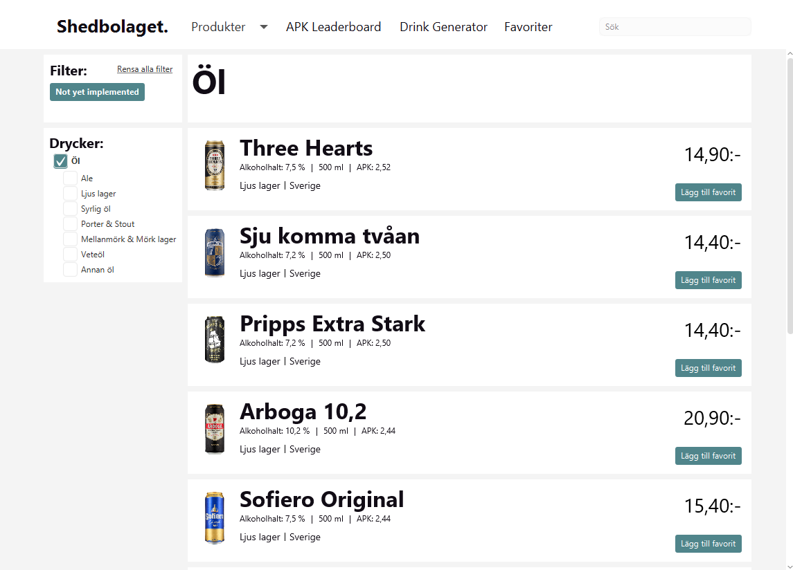

# Requirements and Analysis Document for shed

Samuel Kajava, Daniel Ericsson, Daniel Rygaard, Pouya Shirin & Emil Svensson

2021-09-15

v1.1

## 1 Introduction

Shed is a project that aims to extend the functionality of Systembolaget's website with additional features in a desktop application. Most of the work will be in simply copying what Systembolaget already does. We need to focus on minimal browsing first, to catch bugs and be sure that it will work. Then we will reimplement the rest of Systembolaget's features, to lastly add new features. We will add new features to appeal primarily to students, who are poor, have lots of time on their hands and would like to try every kind of alcohol (or at least every kind of beer) once.

### 1.1 Word book

## 2 Requirements

### 2.1 User Stories

The user stories are ordered after priority, going from high to low. The acceptance criteria are part of the definition of done (DoD), and are structured as yes/no questions. If the answer is yes to all questions, the acceptance criteria are met for the user story in question.

#### 2.1.0 Show specific products

As a user, I want to select specific beverage types to view so that I can see all beverages within that selection.   

**Acceptance:**   

- Can I select a specific type and show all products which share that property?   
- Can I select several types at once and view all relevant products?   
- Can I go the other way and exclude products?   

**Tasks:**  

* Show options for what to select.    
* Show what property is selected.    
* Show products within the selection.    

**Priority:** High.    

***

#### 2.1.1 Show all beverages.  

As a user, I want to be able to browse all beverages so that I can get an overview of what's available.      

**Acceptance:**   

- Can I view all products in the app?   
- Can I see an image of each product?   
- Can I see specific information about the product?   

**Tasks:**  

* Show all beverages.   
* Show the price of each product.   
* Show a thumbnail of each beverage.   

**Priority:** High.  

***

#### 2.1.2 Search for a beverage

As a user, I want to be able to search for a product and find information about it so that I can quickly look up specific beverages.   

**Acceptance:**   

- Can I search for specific products in the range of products?
- Can I use the search function to filter out products in a specific category?
- Am I able to search for products anywhere in the application?

**Tasks:**   

* Show search box.   
* Allow the user to enter a search term in the search box.   
* Show results based on the search term.   

**Priority:** Medium.   

***

#### 2.1.3 Popular beverages

As a user, I want to see new  beverages as soon as I launch the application because I often want to find drinks when I'm unsure what to order at the bar.   

**Acceptance:**   

- Can I see images of new beverages without much effort?
- Can I easily see how much a new beverage costs?

**Tasks:**   

* Show new beverages.  
* Show thumbnail image of the popular beverage.  
* Show price of the popular beverage.  

**Priority:** Medium.

***

#### 2.1.4 Detailed beverage information

As a user, I want to see detailed information about a product, so that I can learn more about products that interest me.   

**Acceptance:**

- Can I view an image of the product?   
- Can I see:   
  - How much it costs?   
  - What its APK is?   
  - How much alcohol it contains?   
  - Its volume?   
  - A detailed description of it?
- Can I obtain this information from anywhere where there are products?   

**Tasks:**  

* Show image of the beverage.   
* Show APK, price, alcohol content and volume.   
* Show description of the beverage.   

**Priority:** Medium.   

***

#### 2.1.5 APK information

As a user, I want to be able to find the products with the highest APK in a leaderboard so that I can see which products are the most cost efficient in terms of alcohol contents.

**Acceptance:**

- Can I view the products with the highest APK?
- Can I choose which product types to view when I'm looking at APK values?
- Can I access an item and get more information about it from the list?

**Tasks:**

* Show the leaderboard.   
* Show the products with the highest APK ratio.   
* Allow the user to choose which type of beverages are shown.   
* Show which type of beverage each product is as well as its name, alcohol contents, volume, apk and price.   

**Priority:** Low.

***

#### 2.1.6 Drink generator

As a user, I want to be able to find drinks based on products I select so that I can find new drink recipes to try out.

**Acceptance:**

- Can I choose some ingredients and get new drinks with added ingredients?
- If I'm not satisfied with my result, can I retry?

**Tasks:**

- Allow users to select some known ingredients.   
- Generate new drinks based on the known ingredients.   
- Show the generated drinks on screen.  

**Priority:** Low.

***

#### 2.1.7 Favorites

As a customer, I want to be able to mark some products as favorites because I want to remember to keep buying those.

**Acceptance:**

- Can I mark a beverage as favorite?
- If I change my mind, can I unmark favourited beverages?

**Tasks:**

- Allow user to mark beverages as favourite.   
- Allow the user to view all marked beverages.   
- Allow the user to unmark beverages in case they change their mind.

**Priority:** Low.

____

### 2.2 Definition of Done

- All acceptance criteria are met. (See 2.1 User Stories)
- All public methods has unit tests.
- All Travis checks pass.
- Completed Java doc (if applicable)
  - All new files need to have an author.
  - All public methods except getters and setters has Javadoc.
- Pull request is accepted by everyone in the group.

### 2.3 User interfaces

This is the starting page for the application. A welcoming message with products displayed at the bottom part of the application.

This navigation bar is shown at the top of the application. This bar is used for almost all of the navigation paths. The Escape Hatch included in the top left corner and the Search bar in the opposite corner. Between these, the user will find the necessary links to the main pages of the application.

Further down in the start page, is a grid of products under the label "New Products".

Entering the products page, will be a list of products on the right, and a choice of secondary categories to the left. 

## 3 Domain model

### 3.1 Class responsibilities

As observed in the domain model image, all class modules work independently with the exception of the references to the Product class. All modules are bound to the product class in some way*, since the whole program is built upon the product data. Each of the modules have their own area of responsibility where they together complete a whole program. The model class 'Shedbolaget' is the main class that brings the modules together to create this desired program.

*Drinking games module not included, since it's a feature not yet to be implemented.

## 4 References
