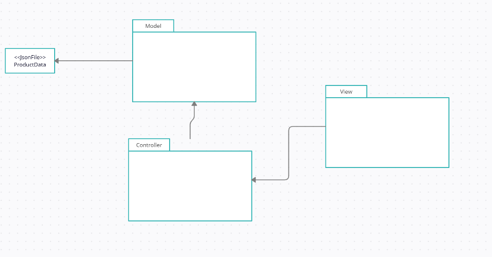
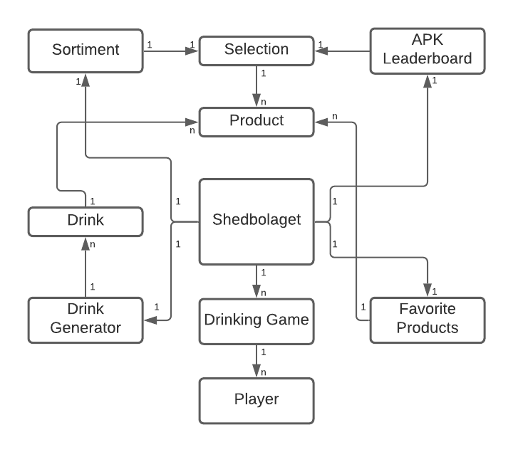
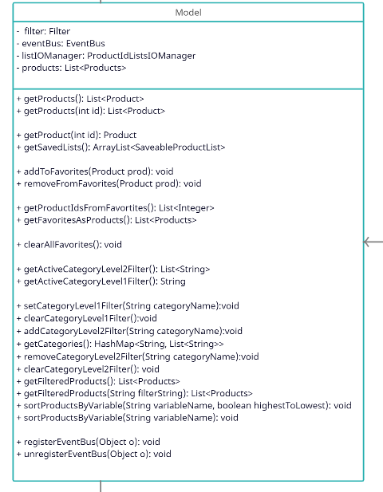
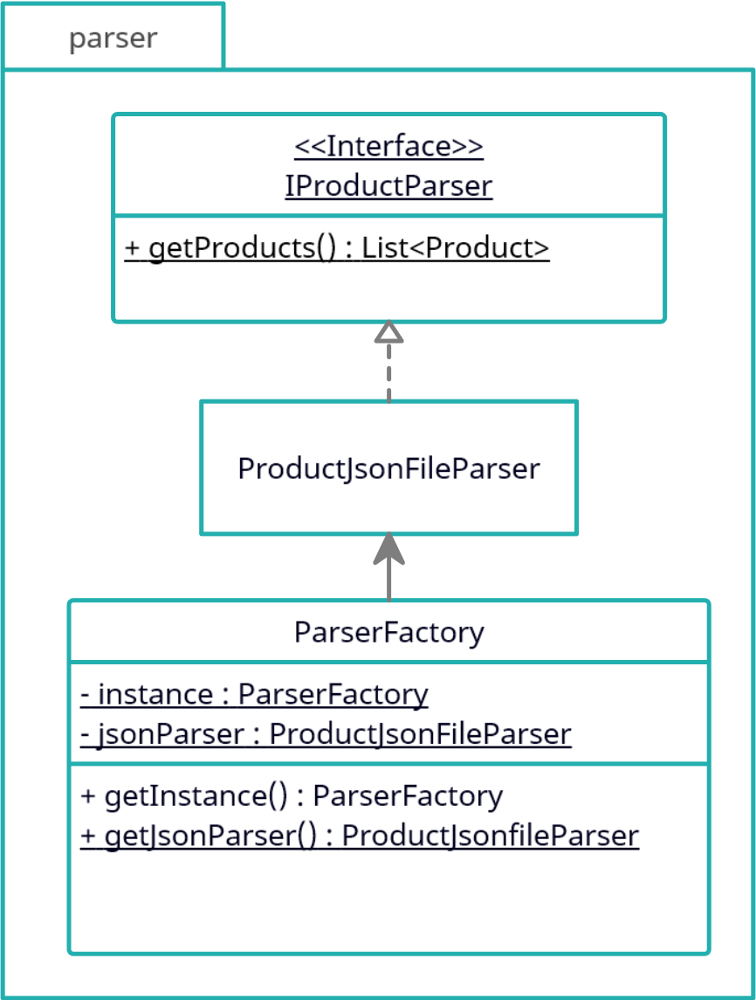
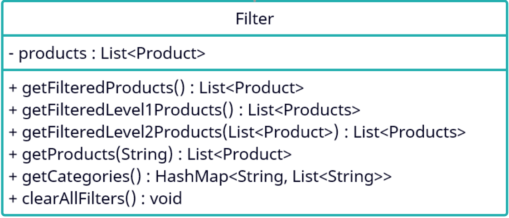
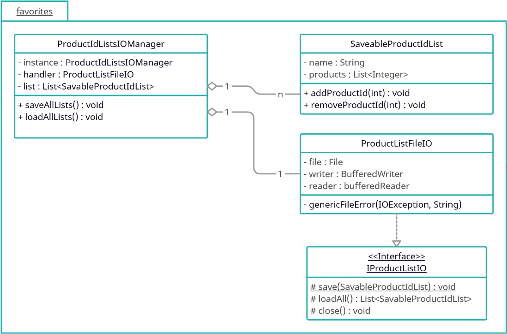
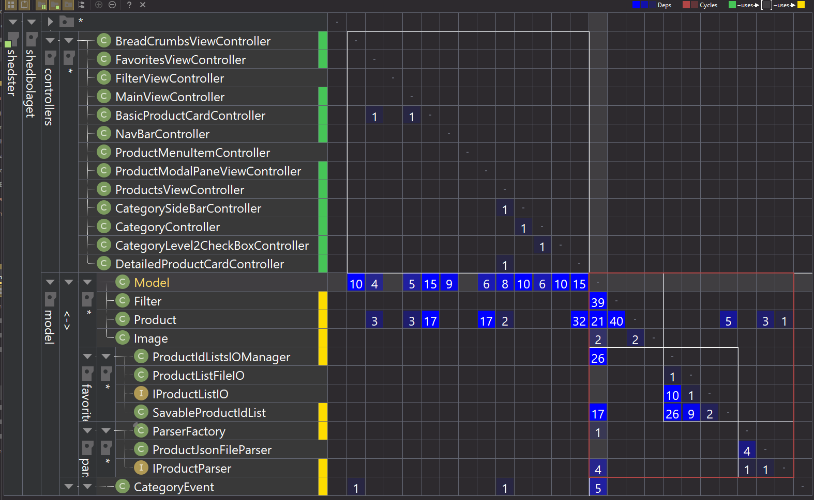
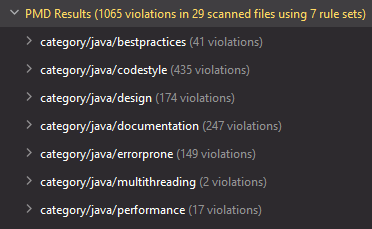

# System design Document för shed

Samuel Kajava, Daniel Rygaard, Pouya Shirin & Emil Svensson

2021-10-07

v2.0

## 1 Introduction
### Shedbolaget overview
Shedbolaget works as a tool for finding alcoholic or none alcoholic beverages or drinks. Users can display multiple types of beverages and get some overall information about it. In addition, the user can see multiple types of drinks, what ingredients the drink includes and how to make them. The user is also able to keep track of which beverages and drinks they like. 

### Purpose of the design document
The SDD document tracks the necessary information required to get a clear picture over the system architecture and system design. As a consequence , gives guidance to the development team on the architecture of the system that is developed.

### 1.1 Word book

###### APK 
	(Alkohol per krona) - Alcohol per crown

## 2 System architecture
In this project the program does not use any database, server or 
external source for storing or retrieving information. Instead, it uses a stored Json file with all the data that is needed. Moreover, if any further information needs to be stored, it is stored via a file saving system implemented into the Favorites module.

### Components
Furthermore, the program has several components that represents the functionality of a certain niched feature.
Therefore, these features combined creates the whole functionality of the program.

 - **Model.** 
A public interface and state handler of the backend. To clarify, this is where the front end will have access to the backend functionality.

- **Favorites.**
Responsible for handling what products the user has marked as favorite.  The favorite's module then stores all the products marked as favorite in a local txt file when the program gets closed. Furthermore, the txt file is then read by the program on the program startup and available for use by the frontend

- **Parsing.**
 Handles all the static data that is represented in the frontend. In addition, the parser translates all the [Products](#Product) from a JSON file and into the program

- **Filter.**
This component is responsible for filtering all the [Products](#Product) in different ways. The allround purpose is for the front end to be able to put in certain criteria, for those [Products](#Product) that met those criteria are then returned and will then be represented in frontend.

- **Drink generator,**
 generates drinks based on certain criteria as well as ingredients that will be specified by the user.
  The ingredients put in will be of type [Products](#Product), the program will then read a set amount of drinks from a local file and check which drinks have these [Products](#Product) as an ingredient

- **[APK](#APK) Leaderboard,**
Displays a list based on the amount of alcohol and the price of a certain [Product](#Product). The product with the most amount of alcohol and the cheapest price will be on the top of the list while the most expensive product with the least amount of alcohol will be at the bottom.

### Features
The features that will be implemented using these components are

- Filter and search for specific products based on user input
- Generate drinks based on certain criteria specified by the user
- See which products contain the best price for the most amount of alcohol

### Flow
Moreover, the program will be used as a utility tool by the user to find information that is needed.
When the user starts the application, he or she will be presented with several products and a carousel, 
in addition there will also be a navigation with different connections to all the features that are listed above.
The user will be able to close the program at any point in the process.

## 3 System design

### Package Diagram

This package digram shows the entirety of the program in it's biggest package model. The uml shows that Model,view,controller structure i followed. 

#### Model

The model package is responsible for handling the logic and handling all the data that the program saves or represents for the user. The features implemented in the model right now is, - filter, filters all the products

- Favorites, saves products as favorites
- Parsing, fetches the data from a Json file

#### View
As a consequence of using Scene builder and FXML files with maven, is that the FXML files need to be in the resource folder.  Therefore the view is not a package in the java structure. However, the dependencies still apply correctly. When we create a FXML file a controller is associated with that file. The FXML file then points to that file and gives it all the Objects and information it needs to execute correctly.

#### Controller
This package includes all of the controllers that is associated to the different FXML files.
A controller for an FXML file handles what happens when a user does any sort of input

### Domain model

Domain model represents the program in a more abstract format. The program will works as follows,

#### Product
	The product represents all the information that is needed from a beverage by the program 
	- Name 
	- Price
	- Alcohol percentage
	- etc
	
#### Selection
	A selection is a asserted number of [product](#Product)s with specific attributes. This is a way of finding products with a specific attribute that the user have selected

#### Sortiment,
	This is where all the information of the products are, lets say the user wants information about a product. The program will then go to Sortiment, get that specific Selection with that product in it and then get the product from that selection.

#### Drink
	Represents all the information the program needs for a drink
	- Name
	- Ingredients(Products)
	- etc
	
#### DrinkGenerator
	This module is responsible for finding a drink based on a list of products(Beverages), the user has specified

#### FavoriteProducts
	FavoriteProducts will save the products that is selected by the user and represent them in a lst of favoritised products

#### Drinking game
	This module is responsible for handling drinking games, the module will have the functionality for the user to play drinking games. The moduel has several different players that will be specified by the user

#### Player
	Represents the information needed by a player for the drinking games
	- name

### Design Model

- **Model**

   
  This module is the Facade pattern, it provides a simpler interface to a complex subsystem. this will be the only connection that is accessible outside of the model package.
  The model uses all the different packages of the backend and represents a simpler way of using them.  
  
  Relation to Domain model
  This combines the four modules in the domain model into one interface
  - APK Leaderboard
  - Sortiment
  - Favorite Products
  - Drink Generator
  
   Patterns  
`- Template Method pattern`  
`- Singleton`  

- **Parser**

   
  The functionality of this module is to fetch data from some type of data storage. In our case, we use a JSON file to store our [Products](#Product). 
 
 Relation to Domain model  
 This in combination with the filter class acts as the Sortiment module in the domain model
  
   Patterns  
 `- Strategy?`  
 `- Adapter patten`  

- **Filter**

This class works as a filter for all the [Products](#Product), it takes in a filter of either 1 or 2 levels and returns the Products that matches these filters.  
 
 Relation to Domain model  
 This divides all the products into different selections  
 This in combination with the Parser class acts as the Sortiment module in the domain model
 
 Patterns  
 
`- No patterns recognised`  

- **Favorites**

 
 This module is responsible from saving all marked [Products](#Product) in a txt file. It saves the list of products when the program is shut down and then fetches them when the program is started again.
 
 The ProductListIOManager class uses the singleton pattern. This is because multiple instances of this class should not be created since it is not needed for any of the functionality.
 Patterns  
 
 Relation to Domain model  
This keeps track of the Favorite products that is also represented in the Domain model
 
 
 `- Singleton`  

Future implementations  

`- Composite`  
	
### Sequence Diagrams

## 4 Persistent data management
- All product data is saved in `data.json`, nd corresponds to Systembolagets sortiment. 
- All views are saved in `src/main/resources`. 
- Saved product ID:s are stored in `SavedLists.txt`.

## 5 Quality

### Tests
Testing the application is done with JUnit, and the test classes can be found in `src/test/java/shedbolaget`. All tests are run using [Travis](https://travis-ci.org/) whenever commits are pushed to the GitHub-repository. Only the backend is tested, since issues with controllers become apparent when using the user interface.

### Known issues
- `Filter` has no way of sorting products by variables that are not numeric, i.e. sorting by Strings like `name` or booleans like `isNew` is not possible at the moment.
- Loading images is very slow for larger quantities of products, making load times slow when looking at broad filters.
- There is no pagination in the `ProductsView`, making it only possible to view the first products in each category.

### Source code analysis

#### Dependency matrix
This matrix displays all dependencies in the project, marking cyclic dependencies in red.

#### Quality report
The overall code quaity has been analysed using PMD. With 1065 violations at the moment of analysis, it is apparent that there is work to be done here, mainly in areas such as documentation, commenting, making variables final and avoiding Law of Demeter.

